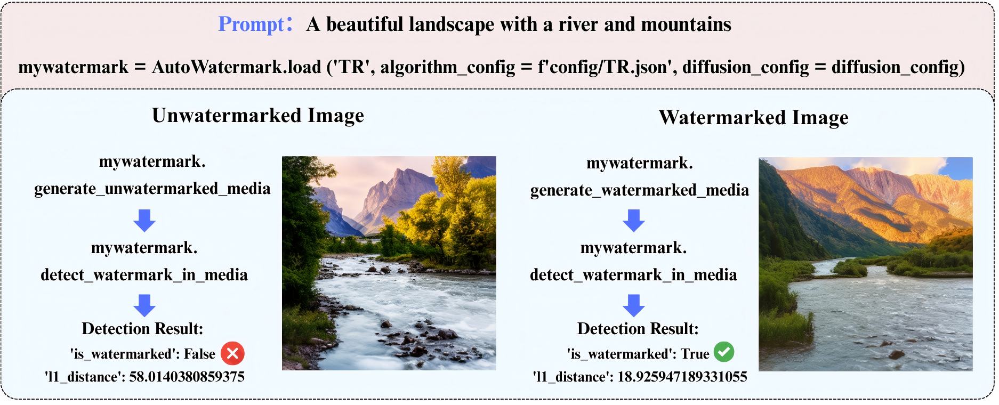

MarkDiffusion Documentation
============================

.. image:: https://img.shields.io/badge/Home-5F259F?style=for-the-badge&logo=homepage&logoColor=white
   :target: https://generative-watermark.github.io/
   :alt: Home

.. image:: https://img.shields.io/badge/Paper-A42C25?style=for-the-badge&logo=arxiv&logoColor=white
   :target: https://arxiv.org/abs/2509.10569
   :alt: Paper

.. image:: https://img.shields.io/badge/Models-%23FFD14D?style=for-the-badge&logo=huggingface&logoColor=black
   :target: https://huggingface.co/Generative-Watermark-Toolkits
   :alt: Models

.. image:: https://img.shields.io/badge/Google--Colab-%23D97700?style=for-the-badge&logo=Google-colab&logoColor=white
   :target: https://colab.research.google.com/drive/1N1C9elDAB5zwF4FxKKYMCqR3eSpCSqAW?usp=sharing
   :alt: Colab

.. image:: https://img.shields.io/badge/PYPI-%23193440?style=for-the-badge&logo=pypi&logoColor=%233775A9
   :target: https://pypi.org/project/markdiffusion
   :alt: PYPI

.. image:: https://img.shields.io/badge/Conda--Forge-%23000000?style=for-the-badge&logo=condaforge&logoColor=%23FFFFFF
   :target: https://github.com/conda-forge/markdiffusion-feedstock
   :alt: CONDA-FORGE

Welcome to MarkDiffusion
-------------------------

**MarkDiffusion** is an open-source Python toolkit for generative watermarking of latent diffusion models. 
As the use of diffusion-based generative models expands, ensuring the authenticity and origin of generated 
media becomes critical. MarkDiffusion simplifies the access, understanding, and assessment of watermarking 
technologies, making it accessible to both researchers and the broader community.

Key Features
------------

🚀 **Unified Implementation Framework**
   MarkDiffusion provides a modular architecture supporting eleven state-of-the-art generative 
   image/video watermarking algorithms of LDMs.

📦 **Comprehensive Algorithm Support**
   Currently implements 11 watermarking algorithms from two major categories:
   
   - **Pattern-based methods**: Tree-Ring, Ring-ID, ROBIN, WIND, SFW
   - **Key-based methods**: Gaussian-Shading, GaussMarker, PRC, SEAL, VideoShield, VideoMark

🔍 **Visualization Solutions**
   The toolkit includes custom visualization tools that enable clear and insightful views into 
   how different watermarking algorithms operate under various scenarios.

📊 **Comprehensive Evaluation Module**
   With 31 evaluation tools covering detectability, robustness, and impact on output quality, 
   MarkDiffusion provides comprehensive assessment capabilities with 6 automated evaluation pipelines.

.. image:: ../img/fig1_overview.png
   :alt: MarkDiffusion Overview
   :width: 100%
   :align: center

|
|

A Quick Example of Generating and Detecting Watermarked Image via MarkDiffusion Toolkit
-----------------------------------------------------------------------------------------

|
|

Documentation Contents
----------------------

.. toctree::
   :maxdepth: 1
   :caption: Quick Start

   quickstart

.. toctree::
   :maxdepth: 2
   :caption: Background Info &
             Detailed Guidance

   user_guide/algorithms
   user_guide/watermarking
   user_guide/visualization
   user_guide/evaluation

.. toctree::
   :maxdepth: 2
   :caption: API Reference

   api/watermark
   api/visualization
   api/utils
   api/evaluation

.. toctree::
   :maxdepth: 2
   :caption: Test System

   test_system/ci_cd_test
   test_system/comprehensive_test

.. toctree::
   :maxdepth: 1
   :caption: Additional Resources

   contributing
   code_of_conduct
   citation
   resources

Indices and tables
==================

* :ref:`genindex`
* :ref:`modindex`
* :ref:`search`

