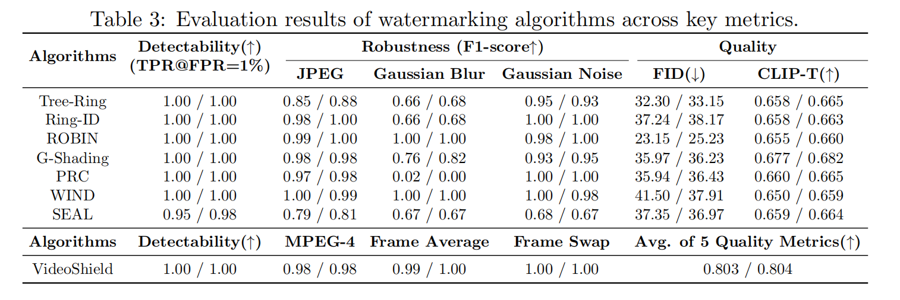

Watermarking Algorithms
=======================

MarkDiffusion supports 11 state-of-the-art watermarking algorithms for latent diffusion models.

Algorithm Overview
------------------

.. list-table::
   :header-rows: 1
   :widths: 15 15 10 60

   * - Algorithm
     - Category
     - Target
     - Description
   * - Tree-Ring (TR)
     - Pattern
     - Image
     - Embeds invisible ring patterns in frequency domain
   * - Ring-ID (RI)
     - Pattern
     - Image
     - Multi-key identification with tree-ring patterns
   * - ROBIN
     - Pattern
     - Image
     - Robust and invisible watermarks with adversarial optimization
   * - WIND
     - Pattern
     - Image
     - Two-stage robust watermarking hidden in noise
   * - SFW
     - Pattern
     - Image
     - Semantic watermarking with Fourier integrity
   * - Gaussian-Shading (GS)
     - Key
     - Image
     - Provable performance-lossless image watermarking
   * - GaussMarker (GM)
     - Key
     - Image
     - Robust dual-domain watermarking
   * - PRC
     - Key
     - Image
     - Undetectable watermark for generative models
   * - SEAL
     - Key
     - Image
     - Semantic-aware image watermarking
   * - VideoShield
     - Key
     - Video
     - Video diffusion model regulation via watermarking
   * - VideoMark
     - Key
     - Video
     - Distortion-free robust watermarking for video

Pattern-Based Methods
---------------------

Pattern-based methods embed predefined patterns into the generation process.

Tree-Ring (TR)
~~~~~~~~~~~~~~

**Reference:** `Tree-Ring Watermarks: Fingerprints for Diffusion Images that are Invisible and Robust <https://arxiv.org/abs/2305.20030>`_

Tree-Ring embeds circular patterns in the Fourier domain of initial latents, making them invisible in the spatial domain but detectable through frequency analysis.

**Key Features:**

- Invisible watermarks in spatial domain
- Robust to common image transformations
- No need for additional neural networks

**Usage:**

.. code-block:: python

   from watermark.auto_watermark import AutoWatermark
   
   watermark = AutoWatermark.load(
       'TR',
       algorithm_config='config/TR.json',
       diffusion_config=diffusion_config
   )
   
   # Generate watermarked image
   image = watermark.generate_watermarked_media(prompt)
   
   # Detect watermark
   result = watermark.detect_watermark_in_media(image)

**Configuration Parameters:**

From ``config/TR.json``:

- ``w_seed``: 999999 - Watermark seed
- ``w_channel``: 0 - Channel index to embed watermark
- ``w_pattern``: "zeros" - Pattern type
- ``w_mask_shape``: "circle" - Mask shape  
- ``w_radius``: 10 - Ring radius in frequency domain
- ``w_pattern_const``: 0 - Pattern constant
- ``threshold``: 50 - Detection threshold

Ring-ID (RI)
~~~~~~~~~~~~

**Reference:** `RingID: Rethinking Tree-Ring Watermarking for Enhanced Multi-Key Identification <https://arxiv.org/abs/2404.14055>`_

Ring-ID extends Tree-Ring to support multiple keys, enabling multi-user identification and improved robustness.

**Key Features:**

- Multi-key identification
- Enhanced robustness
- Backward compatible with Tree-Ring

**Usage:**

.. code-block:: python

   watermark = AutoWatermark.load(
       'RI',
       algorithm_config='config/RI.json',
       diffusion_config=diffusion_config
   )

**Configuration Parameters:**

From ``config/RI.json``:

- ``ring_width``: 1 - Ring width
- ``quantization_levels``: 4 - Quantization levels
- ``ring_value_range``: 64 - Ring value range
- ``assigned_keys``: 10 - Number of assigned keys
- ``radius``: 14 - Ring radius
- ``radius_cutoff``: 3 - Radius cutoff
- ``heter_watermark_channel``: [0] - Heterogeneous watermark channel
- ``ring_watermark_channel``: [3] - Ring watermark channel
- ``threshold``: 50 - Detection threshold

ROBIN
~~~~~

**Reference:** `ROBIN: Robust and Invisible Watermarks for Diffusion Models with Adversarial Optimization <https://arxiv.org/abs/2411.03862>`_

ROBIN uses adversarial optimization to create robust watermarks that are invisible to human eyes and resistant to attacks.

**Key Features:**

- Adversarial optimization for robustness
- Invisible watermarks
- Trained watermark generator

**Usage:**

.. code-block:: python

   watermark = AutoWatermark.load(
       'ROBIN',
       algorithm_config='config/ROBIN.json',
       diffusion_config=diffusion_config
   )

**Configuration Parameters:**

From ``config/ROBIN.json``:

- ``w_seed``: 999999 - Watermark seed
- ``w_channel``: 3 - Watermark channel
- ``w_pattern``: "ring" - Pattern type
- ``w_up_radius``: 30 - Upper radius
- ``w_low_radius``: 5 - Lower radius
- ``watermarking_step``: 35 - Watermarking injection step
- ``threshold``: 45 - Detection threshold
- ``learning_rate``: 0.0005 - Training learning rate
- ``max_train_steps``: 2000 - Maximum training steps

WIND
~~~~

**Reference:** `Hidden in the Noise: Two-Stage Robust Watermarking for Images <https://arxiv.org/abs/2412.04653>`_

WIND implements a two-stage watermarking approach that hides watermarks in the noise initialization.

**Key Features:**

- Two-stage watermarking
- Hidden in initial noise
- High robustness

**Usage:**

.. code-block:: python

   watermark = AutoWatermark.load(
       'WIND',
       algorithm_config='config/WIND.json',
       diffusion_config=diffusion_config
   )

SFW
~~~

**Reference:** `Semantic Watermarking Reinvented: Enhancing Robustness and Generation Quality with Fourier Integrity <https://arxiv.org/abs/2509.07647>`_

SFW combines semantic information with Fourier domain watermarking for enhanced robustness and quality.

**Key Features:**

- Semantic-aware watermarking
- Fourier integrity preservation
- Minimal quality degradation

**Usage:**

.. code-block:: python

   watermark = AutoWatermark.load(
       'SFW',
       algorithm_config='config/SFW.json',
       diffusion_config=diffusion_config
   )

Key-Based Methods
-----------------

Key-based methods use secret keys to embed and extract watermarks.

Gaussian-Shading (GS)
~~~~~~~~~~~~~~~~~~~~~

**Reference:** `Gaussian Shading: Provable Performance-Lossless Image Watermarking for Diffusion Models <https://arxiv.org/abs/2404.04956>`_

Gaussian-Shading provides provably performance-lossless watermarking by injecting Gaussian noise into the generation process.

**Key Features:**

- Performance-lossless (provable)
- No quality degradation
- Simple and efficient

**Usage:**

.. code-block:: python

   watermark = AutoWatermark.load(
       'GS',
       algorithm_config='config/GS.json',
       diffusion_config=diffusion_config
   )

**Configuration Parameters:**

From ``config/GS.json``:

- ``channel_copy``: 1 - Channel to copy watermark
- ``wm_key``: 42 - Watermark key
- ``hw_copy``: 8 - Height/width copy parameter
- ``chacha``: true - Use ChaCha encryption
- ``chacha_key_seed``: 123456 - ChaCha key seed
- ``chacha_nonce_seed``: 789012 - ChaCha nonce seed
- ``threshold``: 0.7 - Detection threshold

GaussMarker (GM)
~~~~~~~~~~~~~~~~

**Reference:** `GaussMarker: Robust Dual-Domain Watermark for Diffusion Models <https://arxiv.org/abs/2506.11444>`_

GaussMarker combines spatial and frequency domain watermarking for enhanced robustness.

**Key Features:**

- Dual-domain watermarking
- Trained GNR (Gaussian Noise Residual) network
- High robustness to attacks

**Usage:**

.. code-block:: python

   watermark = AutoWatermark.load(
       'GM',
       algorithm_config='config/GM.json',
       diffusion_config=diffusion_config
   )

**Training GNR Network:**

.. code-block:: bash

   python watermark/gm/train_GNR.py --config config/GM.json

PRC
~~~

**Reference:** `An undetectable watermark for generative image models <https://arxiv.org/abs/2410.07369>`_

PRC creates undetectable watermarks that are imperceptible to human observers and detection systems.

**Key Features:**

- Undetectable by design
- High security
- Minimal perceptual impact

**Usage:**

.. code-block:: python

   watermark = AutoWatermark.load(
       'PRC',
       algorithm_config='config/PRC.json',
       diffusion_config=diffusion_config
   )

SEAL
~~~~

**Reference:** `SEAL: Semantic Aware Image Watermarking <https://arxiv.org/abs/2503.12172>`_

SEAL leverages semantic information to embed watermarks that adapt to image content.

**Key Features:**

- Semantic-aware embedding
- Content-adaptive watermarking
- Preserved semantic integrity

**Usage:**

.. code-block:: python

   watermark = AutoWatermark.load(
       'SEAL',
       algorithm_config='config/SEAL.json',
       diffusion_config=diffusion_config
   )

Video Watermarking Methods
---------------------------

VideoShield
~~~~~~~~~~~

**Reference:** `VideoShield: Regulating Diffusion-based Video Generation Models via Watermarking <https://arxiv.org/abs/2501.14195>`_

VideoShield embeds watermarks into video generation models for content regulation and tracking.

**Key Features:**

- Video-specific watermarking
- Temporal consistency
- Frame-level detection

**Usage:**

.. code-block:: python

   watermark = AutoWatermark.load(
       'VideoShield',
       algorithm_config='config/VideoShield.json',
       diffusion_config=video_diffusion_config
   )
   
   # Generate watermarked video frames
   frames = watermark.generate_watermarked_media(prompt)
   
   # Detect in video
   result = watermark.detect_watermark_in_media(frames)

VideoMark
~~~~~~~~~

**Reference:** `VideoMark: A Distortion-Free Robust Watermarking Framework for Video Diffusion Models <https://arxiv.org/abs/2504.16359>`_

VideoMark provides distortion-free watermarking specifically designed for video diffusion models.

**Key Features:**

- Distortion-free embedding
- Robust to video compression
- Temporal coherence preservation

**Usage:**

.. code-block:: python

   watermark = AutoWatermark.load(
       'VideoMark',
       algorithm_config='config/VideoMark.json',
       diffusion_config=video_diffusion_config
   )

Algorithm Comparison
--------------------

Choosing the Right Algorithm
~~~~~~~~~~~~~~~~~~~~~~~~~~~~~

**For High Invisibility:**

- Gaussian-Shading (GS) - Provably lossless
- PRC - Designed for undetectability
- Tree-Ring (TR) - Invisible in spatial domain

**For High Robustness:**

- ROBIN - Adversarial optimization
- GaussMarker (GM) - Dual-domain approach
- WIND - Two-stage robustness

**For Video Content:**

- VideoShield - Video regulation
- VideoMark - Distortion-free video watermarking

**For Multi-User Scenarios:**

- Ring-ID (RI) - Multi-key support
- SEAL - Semantic-aware adaptation

Algorithm Comparison
~~~~~~~~~~~~~~~~~~~~

The following figure shows the performance comparison of different watermarking algorithms:

Next Steps
----------

- :doc:`../tutorial` - Hands-on tutorials for each algorithm
- :doc:`watermarking` - Detailed watermarking workflow
- :doc:`visualization` - Visualize how algorithms work
- :doc:`evaluation` - Evaluate algorithm performance

